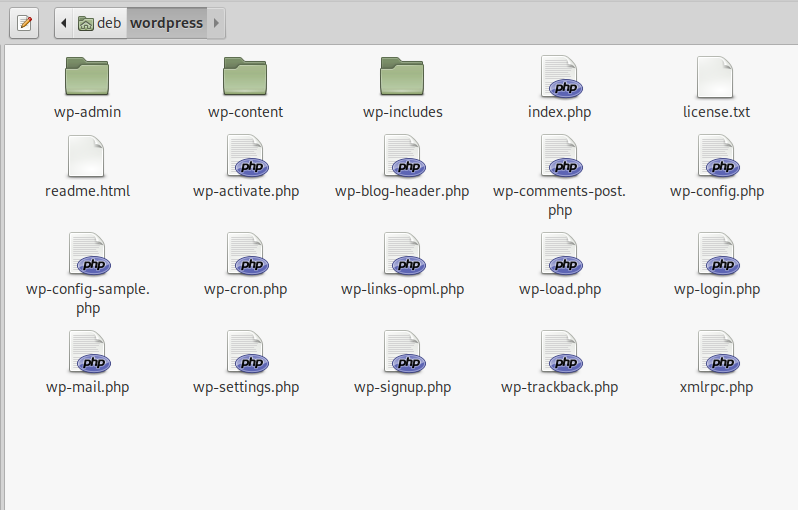

# `03` Descarga Wordpress

Wordpress es un sistema de gestión de contenido de código abierto, lo puedes encontrar en su web oficial [wordpress.org](wordpress.org/download). Una vez descargado el archivo comprimido deberás extraer el contenido y verás una carpeta con los archivos necesarios para tu sitio.

Todo esto se puede realizar tambien desde la terminal con el siguiente comando

> wget  https://wordpress.org/latest.tar.gz -qO - | tar -xzf -