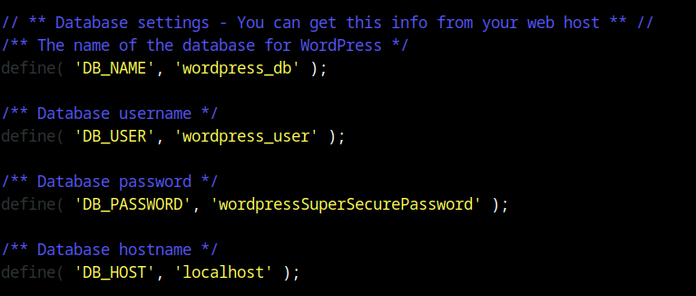
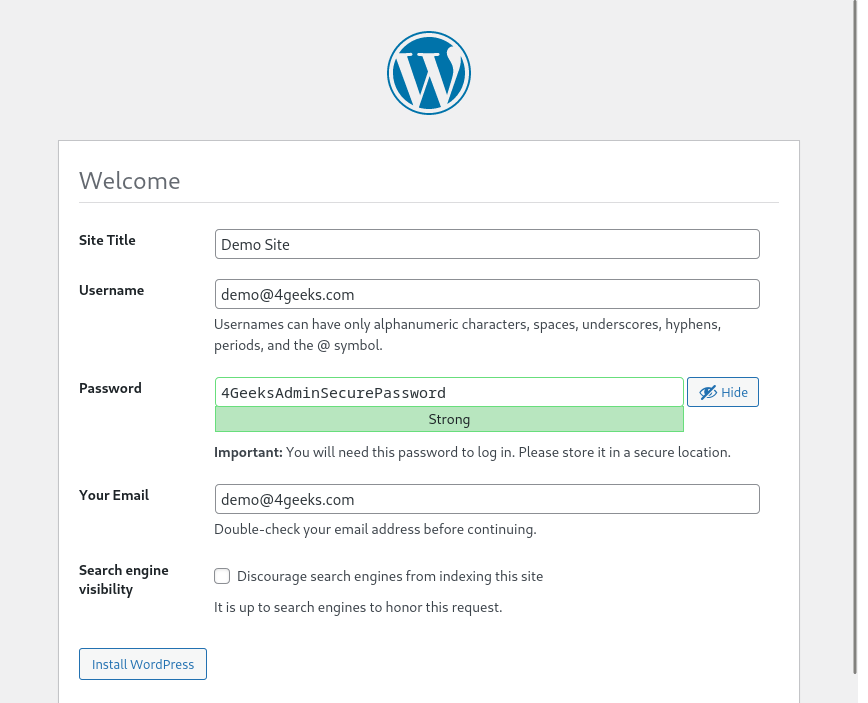

# `05` Configuración del sitio Wordpress

Una vez que ya has copiado los archivos a tu carpeta web es hora de configurar tu sitio para su funcionamiento. 

Lo primero que debes hacer es copiar el archivo `wp-config-sample.php` y crear uno llamado `wp-config.php`, el cual va a contener los parámetros de acceso a la base de datos de wordpress (el archivo `wp-config-sample.php` funciona como una plantilla). Una vez ahi dentro deberás actualizar los parámetros de acceso de a la base de datos.

Si todo funciona bien al abrir en el navegador la dirección [localhost/wordpress](localhost/wordpress) podrás ver una página web donde deberás ingresar el titulo del sitio y se te solicitarán los datos de lo que será el usuario administrador de tu web Wordpress.

## 📝 Instrucciones

1. Copia la carpeta extraída del comprimido de wordpress, a la carpeta `/var/www/html`
2. Configura el archivo wp-config.php con los parámetros de acceso a la base de datos.
3. Entra en la dirección local de tu wordpress [localhost/wordpress](localhost/wordpress) y configura los datos del sitio.

## 💡Pista

- Cualquier error en la configuración del archivo `wp-config.php` lo verás a la hora de entrar a la dirección [localhost/wordpress](localhost/wordpress). El mensaje puede indicarte donde ésta el error

- Si tu máquina virtual está en una Red Nat, Red Solo anfitrion o usa un adaptador puente, puedes usar la dirección ip de esta para ver el sitio web desde otro equipos

- Si has realizado cambios en la configuración o alguna instalación en el servidor web, puede que necesites reiniciar el servicio de apache con el siguiente comando:

> sudo systemctl restart apache2